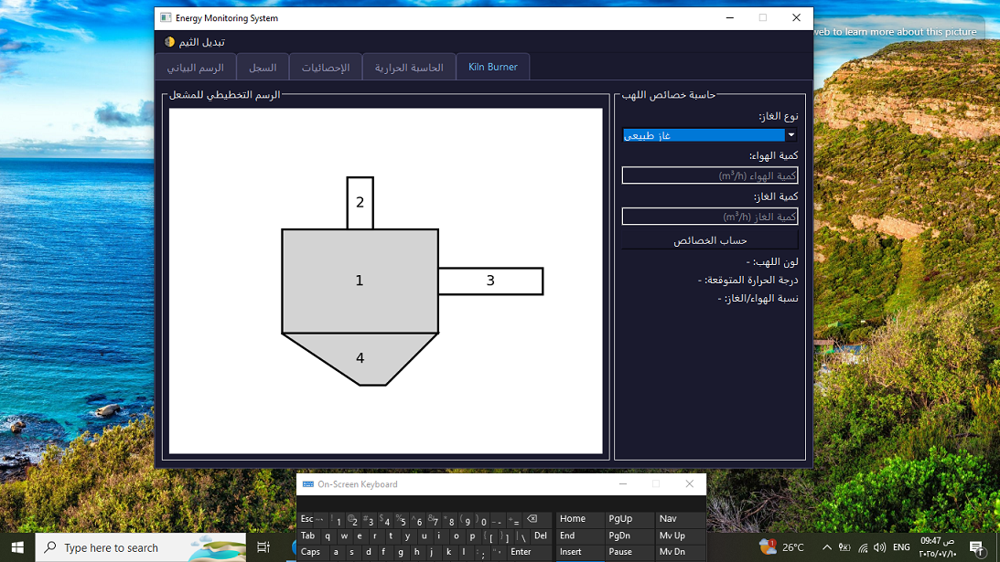

# energy-monitor
# ⚡ Energy Monitor

**Energy Monitor** is a desktop application developed using **Python** and **PyQt6**. It is designed to visualize, track, and analyze energy data in real-time. This version is a demo created for evaluation purposes only.




---

## 🚀 Features

- 📈 Live graph view of energy consumption.
- 🗂 History view to browse past data.
- 🧮 SQLite-based local database for storing records.
- 🖥 Simple, intuitive user interface built with PyQt6.
- 🧪 Includes unit tests for key modules.

---

## 📁 Project Structure

```bash
energy_monitor/
├── main.py                    # Main entry point
├── requirements.txt           # Required packages
├── app/
│   ├── controllers/           # Control logic
│   ├── models/                # Database + data models
│   └── views/                 # UI components (MainWindow, Graph, etc.)
├── assets/                   # Icons and styles
└── tests/                    # Unit tests

ps://github.com/user-attachments/assets/7090a259-76c1-4866-9b33-a017fc6cce06" />
